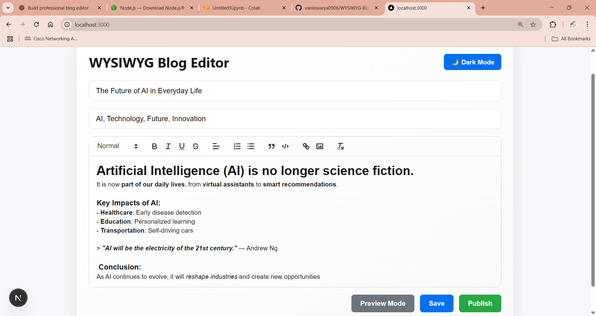

# 📝 WYSIWYG Blog Editor

A professional **WYSIWYG (What You See Is What You Get) Blog Editor** built with **Next.js** and **React Quill**, featuring a clean and modern UI, **dark/light mode toggle**, and **preview functionality**.

-

## ✨ Features
- 🖊 **Rich Text Editing** — Bold, italic, underline, headings, lists, blockquotes, code blocks, images, and links
- 🌗 **Dark & Light Mode Toggle**
- 👀 **Preview Mode** — See your blog post exactly as it will appear
- 🏷 **Tags Support** — Add multiple comma-separated tags
- 💾 **Save & Publish Buttons** — Show confirmation messages (no backend)
- 🎨 **Modern, Centered, and Responsive UI**

---

## 🚀 Getting Started

### 1️⃣ Clone the repository
```bash
git clone  https://github.com/vaniiswarya0906/WYSIWYG-Blog-Editor.git
cd wysiwyg-blog-editor
---
## 📸 Screenshot


